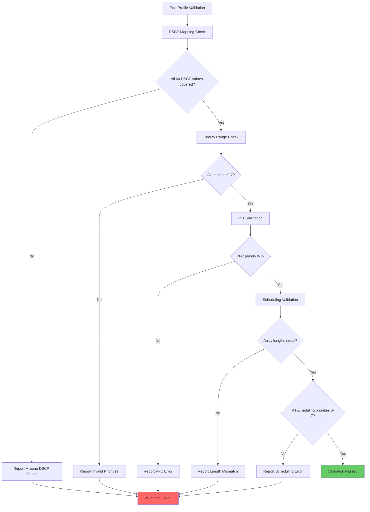
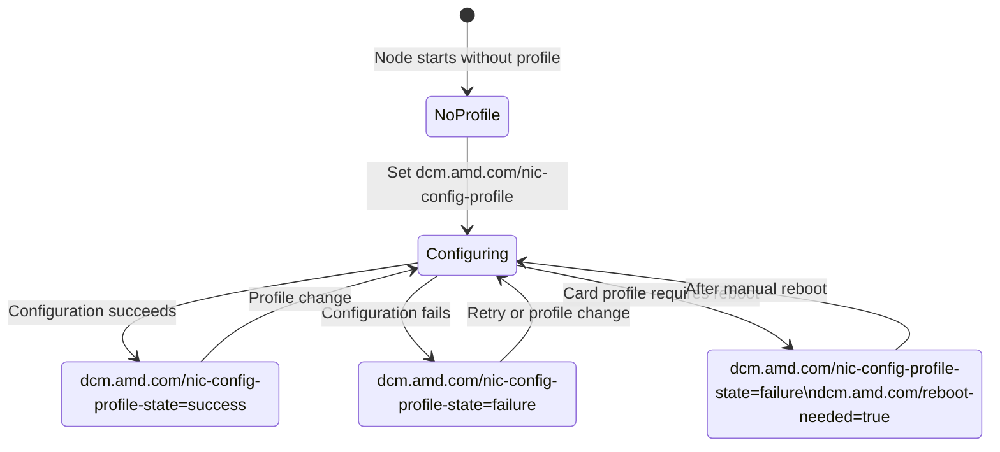
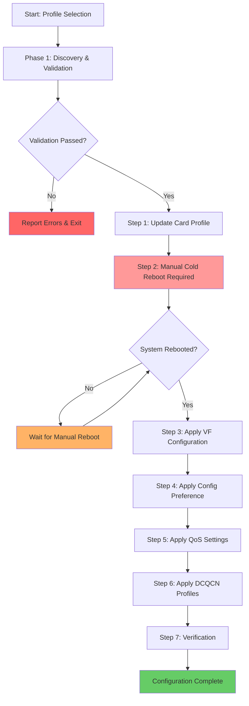

# AINIC Configuration in Device Config Manager

[](https://opensource.org/licenses/Apache-2.0)
[](https://golang.org/)
[](https://www.docker.com/)

## Table of Contents

- [Overview](#overview)
- [Quick Start](#quick-start)
- [Configuration Schema](#configuration-schema-json)
- [Deployment Modes](#deployment-modes)
- [Core Operations](#core-operations)
- [Testing](#testing)
- [Developer Guide](#developer-guide)
- [Troubleshooting](#troubleshooting)
- [Contributing](#contributing)
- [License](#license)

## Overview

The Device Config Manager (DCM) is a unified component that handles both AMD GPU and AINIC (pollara/vulcano) device configurations. DCM provides a single binary and container solution capable of:

- **GPU Configuration**: GPU partitioning and hardware management
- **AINIC Configuration**: AI network card profile and performance management  
- **Unified Operation**: Single binary automatically detects and manages both device types
- **Concurrent Management**: Can handle GPU and AINIC devices simultaneously
- **Environment Adaptation**: Automatically adapts behavior for Kubernetes vs Debian deployments

**Key AINIC Configuration Capabilities:**

- **Card Profiles**: VF (Virtual Function) or PF (Physical Function) card profile configuration
- **SR-IOV Management**: Number of VFs configuration
- **Config Preference**: Provider vs. Workload mode selection
- **DCQCN Configuration**: Congestion control parameters for VF/PF
- **QoS Configuration**: Quality of Service settings
- **Physical Port Configuration**: Speed, MTU, and other port parameters

**Deployment Flexibility:**

- **Unified Container**: Single DCM instance handles both GPU and AINIC configurations
- **Auto-Discovery**: Automatically detects available device configurations
- **Separate ConfigMaps**: AINIC configurations use different ConfigMaps than GPU configurations
- **Node-based Profiles**: Apply different profiles to different nodes using Kubernetes node labels

## Quick Start

### Prerequisites

- **Hardware**: AMD AINIC-compatible network devices
- **Operating System**: Ubuntu 22.04/24.04 or RHEL 9
- **Kubernetes**: v1.24+ (for Kubernetes deployment)
- **Dependencies**: nicctl utility for AINIC device management

### 30-Second Setup

#### Helm Deployment (Recommended)

```bash
# 1. Install DCM with AINIC support using Helm
helm install dcm ./helm-charts \
  --set image.repository=docker.io/rocm/device-config-manager \
  --set image.tag=v1.4.0 \
  --set configMap=dcm-gpu-config \
  --set ainicConfigMap=ainic-config \
  --namespace kube-system

# 2. Verify AINIC ConfigMap was created
kubectl get configmap ainic-config -n kube-system

# 3. Label node to apply AINIC profile
kubectl label node <node-name> dcm.amd.com/nic-config-profile=default
```

#### Standalone Kubernetes Deployment

```bash
# 1. Apply DCM DaemonSet (part of GPU Operator)
kubectl apply -f dcm-daemonset.yaml

# 2. Create AINIC configuration
kubectl create configmap ainic-config --from-file=ainic_config.json

# 3. Label node for AINIC configuration
kubectl label node <node-name> dcm.amd.com/nic-config-profile=nodeprof1
```

#### Debian/Ubuntu Deployment

```bash
# 1. Download and install DCM package
wget https://github.com/ROCm/device-config-manager/releases/latest/download/amdgpu-configmanager_24.04_amd64.deb
sudo dpkg -i amdgpu-configmanager_24.04_amd64.deb

# 2. Configure AINIC profile
sudo cp ainic_config.json /etc/dcm/

# 3. Start DCM service
sudo systemctl start amd-config-manager
```

### Verify Installation

```bash
# Check AINIC devices are detected
nicctl show card --json

# Check DCM is running
kubectl get pods -n kube-system | grep device-config-manager
# OR for Debian
sudo systemctl status amd-config-manager
```

## Architecture

### DCM Component Architecture

```
┌─ Device Config Manager (DCM) Container ─────────────────────────────────────┐
│                                                                              │
│                    ┌─ AINIC Config Module ─────────────────┐                 │
│                    │                                       │                 │
│                    │ • Device Discovery (nicctl)           │                 │
│                    │ • Profile Validation                  │                 │
│                    │ • Configuration Engine                │                 │
│                    │ • Hardware Programming                │                 │
│                    └───────────────────────────────────────┘                 │
│                                                                              │
└──────────────────────────────────┬───────────────────────────────────────────┘
                                   │
                   ┌───────────────▼────────────────┐
                   │      Deployment Mode           │
                   └───────────────┬────────────────┘
                                   │
          ┌────────────────────────┴─────────────────────────┐
          │                                                  │
     ┌────▼─────┐                                     ┌─────▼─────┐
     │Kubernetes│                                     │   Debian  │
     │   Mode   │                                     │   Mode    │
     └────┬─────┘                                     └─────┬─────┘
          │                                                 │
          │                                                 │
┌─────────▼──────────┐                              ┌───────▼────────┐
│    ConfigMap       │                              │  config.json   │
│                    │                              │                │
│  ┌──────────────┐  │                              │ • selectedProfile
│  │ ainic.json   │  │                              │ • nodeProfiles │
│  │              │  │                              │ • nicProfiles  │
│  │• nodeProfiles│  │                              │ • port_profiles│
│  │• nicProfiles │  │                              │ • dcqcn_profiles
│  │• port_profiles  │                              │                │
│  │• dcqcn_profiles │                              └────────────────┘
│  └──────────────┘  │                                       │
└─────────┬──────────┘                                       │
          │                                                  │
┌─────────▼──────────┐  ┌─────────────────┐          ┌───────▼────────┐
│ ConfigMap Watcher  │  │   Node Labels   │          │ File Watcher   │
│                    │  │                 │          │                │
│ Monitors:          │  │ dcm.amd.com/    │          │ Monitors:      │
│ ConfigMap updates  │  │ nic-config-     │          │ config.json    │
│                    │  │ profile =       │          │ changes        │
│                    │  │ "nodeprof1"     │          │                │
└─────────┬──────────┘  └─────────┬───────┘          └────────────────┘
          │                       │                           │
          └───────────────────────┼───────────────────────────┘
                                  │
                         ┌────────▼─────────┐
                         │ Profile Selector │
                         │                  │
                         │ K8s: Label Value │
                         │ Debian: JSON Field
                         └────────┬─────────┘
                                  │
                         ┌────────▼─────────┐
                         │Configuration     │
                         │Engine            │
                         │                  │
                         │• Device Discovery│
                         │• Validation      │
                         │• nicctl Execution│
                         │• Monitoring      │
                         └────────┬─────────┘
                                  │
                         ┌────────▼─────────┐
                         │ AINIC Hardware   │
                         │                  │
                         │• Card Profiles   │
                         │• SR-IOV Config   │
                         │• QoS Settings    │
                         │• DCQCN Parameters│
                         └──────────────────┘
```

## Prerequisites

> [!IMPORTANT]
> Before deploying the AINIC Device Configuration Manager, ensure your environment meets the following requirements:

- **Hardware**: AMD AI NIC cards with RoCE support
- **Tools**: `nicctl` utility installed on host (for Kubernetes mode, mount `nicctl` binary via volumeMount to make it accessible within the DCM pod)
- **Kubernetes** (optional): For cluster deployments, not required for debian mode

> [!WARNING]
> Configuration changes may require system reboot for hardware-level profile changes to take effect.

## AINIC Port Configuration

### The Problem: Duplicate Port Names Across Cards

In multi-card systems, port names repeat across cards:

```
Card A (uuid-card-a):          Card B (uuid-card-b):
├── eth1/1 (uuid-a-port1)      ├── eth1/1 (uuid-b-port1)  ← Same name!
├── eth1/2 (uuid-a-port2)      ├── eth1/2 (uuid-b-port2)  ← Same name!
└── eth1/3 (uuid-a-port3)      └── eth1/3 (uuid-b-port3)  ← Same name!

Card C (uuid-card-c):          Card D (uuid-card-d):
├── eth1/1 (uuid-c-port1)      ├── eth1/1 (uuid-d-port1)  ← Same name!
├── eth1/2 (uuid-c-port2)      ├── eth1/2 (uuid-d-port2)  ← Same name!
└── eth1/3 (uuid-c-port3)      └── eth1/3 (uuid-d-port3)  ← Same name!
```

### The Solution: Port Name → ALL Matching Ports

When you configure a port name, it applies to ALL ports with that name across ALL cards.

**Configuration Example:**

```json
{
  "port_profiles": {
    "high_speed": {"speed": "100g", "mtu": 9000},
    "management": {"speed": "10g", "mtu": 1500},
    "disabled": {"admin_state": "down"}
  },
  "nicProfiles": {
    "my_cluster": {
      "match_filters": [{"card_id": "all"}],
      "port_profile": {
        "eth1/1": "high_speed",
        "eth1/2": "management", 
        "all": "disabled"
      }
    }
  }
}
```

**What Happens:**

- `eth1/1` → `high_speed` profile applied to 4 ports (one on each card)
- `eth1/2` → `management` profile applied to 4 ports (one on each card)  
- `eth1/3` → `disabled` profile applied to 4 ports (via "all" fallback)

**Actual Commands Executed:**

```bash
# MTU settings
nicctl update port -p uuid-a-port1 --mtu 9000     # Card A, eth1/1  
nicctl update port -p uuid-b-port1 --mtu 9000     # Card B, eth1/1
nicctl update port -p uuid-c-port1 --mtu 9000     # Card C, eth1/1
nicctl update port -p uuid-d-port1 --mtu 9000     # Card D, eth1/1

# Speed and pause settings  
nicctl update port -p uuid-a-port1 --pause-type pfc --rx-pause enable --tx-pause enable
nicctl update port -p uuid-b-port1 --pause-type pfc --rx-pause enable --tx-pause enable
nicctl update port -p uuid-c-port1 --pause-type pfc --rx-pause enable --tx-pause enable
nicctl update port -p uuid-d-port1 --pause-type pfc --rx-pause enable --tx-pause enable

# QoS settings (if configured)
nicctl update qos --classification-type DSCP
nicctl update qos -p uuid-a-port1 dscp-to-priority --dscp 10 --priority 0
nicctl update qos -p uuid-a-port1 pfc --priority 0 --no-drop enable
nicctl update qos -p uuid-a-port1 scheduling --priority 0,1,7 --rate-limit 0,0,10 --dwrr 99,1,0
# (repeated for each port UUID...)
```

### Port Coverage Validation

The system validates that every port has a profile assignment.

**Valid Configuration:**

```json
"port_profile": {
  "eth1/1": "high_speed",
  "eth1/2": "management",
  "all": "disabled"
}
```

Result: PASS - All ports covered (eth1/3 uses "all" fallback)

**Invalid Configuration:**

```json
"port_profile": {
  "eth1/1": "high_speed",
  "eth1/2": "management"
}
```

Result: FAIL - eth1/3 ports not covered (no "all" fallback)

**Key Rules:**

1. **One Configuration → Multiple Ports**: `"eth1/1": "profile"` affects ALL eth1/1 ports across ALL cards
2. **"all" is Fallback**: Ports without specific configuration use "all" profile
3. **Complete Coverage Required**: Every port must have either specific or "all" assignment
4. **Profile Must Exist**: All referenced profiles must be defined in `port_profiles` section

### The "all" Keyword

The `"all"` keyword is special - it applies to **every port that doesn't have a specific configuration**.

**Example with "all" only:**

```json
"port_profile": {
  "all": "standard"
}
```

**Result**: ALL ports on ALL cards get the same "standard" profile

**Commands executed:**

```bash
# Uses --all flag for efficiency (applies to all ports at once)
nicctl update port --all --mtu 1500
nicctl update port --all --pause-type pfc --rx-pause enable --tx-pause enable
nicctl update qos --classification-type DSCP
# etc...
```

**Invalid - Cannot mix specific and "all":**

```json
"port_profile": {
  "eth1/1": "high_speed",
  "all": "standard"  
}
```

**Problem**: This creates overlap - eth1/1 ports would get BOTH "high_speed" AND "standard" profiles, which is invalid.

**Correct approach for mixed configuration:**

```json
"port_profile": {
  "eth1/1": "high_speed",
  "eth1/2": "management",
  "eth1/3": "standard"
}
```

**Result**: Each port type gets exactly one profile, no overlaps.

## Configuration Schema (JSON)

The system uses a hierarchical JSON configuration structure with the following main components:

### 1. DCQCN Profiles (`dcqcn_profiles`)

DCQCN (Data Center Quantized Congestion Notification) profiles define congestion control parameters for RoCE networks:

```json
{
  "dcqcn_profiles": {
    "p1": {
      "tokenBucketSize": 800000,
      "rateIncreaseByteCount": 431068,
      "rateReduceMonitorPeriod": 1,
      "initialAlphaValue": 64,
      "alphaUpdateG": 512,
      "aiRate": 160,
      "haiRate": 300,
      "alphaUpdateInterval": 1,
      "cnpDscp": 46,
      "clampTargetRateEn": false,
      "minRate": 1,
      "rateIncreaseThreshold": 5,
      "rateIncreaseInterval": 5
    }
  }
}
```

**Parameters:**

- `cnpDscp`: DSCP value used by Notification Point (NP) for Congestion Notification Packets (CNPs) (recommended: 0)
- `initialAlphaValue`: Initial value of alpha used by Reaction Point (RP) when receiving the first CNP for a flow (recommended: 1023)
- `alphaUpdateInterval`: Timer interval period for updating alpha value in microseconds (recommended: 55)
- `alphaUpdateG`: Value of G in DCQCN algorithm that controls the rate at which alpha value is updated (recommended: 1019)
- `rateIncreaseByteCount`: Sent bytes count between rate increase events for Reaction Point (RP) (recommended: 32767)
- `aiRate`: Rate increase value in Additive Increase phase for RP in Mbps (recommended: 5)
- `haiRate`: Rate increase value in Hyper Increase phase for RP in Mbps (recommended: 50)
- `tokenBucketSize`: Token bucket size for accumulating tokens that allow bursty traffic (recommended: 150000)
- `rateReduceMonitorPeriod`: Rate reduce monitor period in microseconds (recommended: 4)
- `disable`: Boolean flag to disable DCQCN (recommended: false)
- `clampTargetRateEn`: Enable or disable clamping of target rate to current rate on receiving CNP (recommended: false)
- `minRate`: Minimum rate set by RP in Mbps (recommended: 1)
- `rateIncreaseThreshold`: Threshold of rate increase events for moving to next rate increase phase, range 1-31 (recommended: 5)
- `rateIncreaseInterval`: Time interval between rate increase events as number of TCP RTTs (recommended: 5)

> [!NOTE]
> The `disable` parameter can be used to completely disable DCQCN for a specific profile. When set to true, the `--disable` flag is passed to nicctl, overriding all other DCQCN parameters for that profile.
>
> DCQCN parameters are highly sensitive to network topology and traffic patterns. Consult AMD documentation for recommended values for your specific use case.

### 2. Port Profiles (`port_profiles`)

```json
{
  "port_profiles": {
    "pp2": {
      "admin_state": "up",
      "mtu": 9064,
      "pause_type": "pfc",
      "speed": "100g",
      "classification_type": "dscp",
      "dscp_to_priority": [{"dscp": ["10"], "priority": 0}],
      "pfc": {"priority": 0, "no_drop": "enable"},
      "scheduling": {"priority": [0, 1, 6], "rate_limit": [0, 0, 10], "dwrr": [99, 1, 0]}
    }
  }
}
```

> [!TIP]
> Use `pp1` for basic configurations and `pp2` for advanced QoS scenarios requiring fine-grained traffic control.

### 3. NIC Profiles (`nicProfiles`)

```json
{
  "nicProfiles": {
    "nicprof0_1": {
      "match_filters": [{"card_id": "all"}],
      "card_profile": "pf_default",
      "config_preference": "workload",
      "port_profile": "pp2",
      "vf_count": 1,
      "dcqcn": [{"match_filters_dcqcn": [{"dev_id": "all"}], "profiles": ["p1", "p2", "p3", "p4", "p5", "p6", "p7", "p8"]}]
    }
  }
}
```

### 4. Node Profiles (`nodeProfiles`)

```json
{
  "nodeProfiles": {
    "nodeprof0": {"nicprofiles":["nicprof0_1"], "reboot_type":"cold"},
    "nodeprof1": {"nicprofiles":["nicprof2", "nicprof5"], "reboot_type":"cold"},
    "nodeprof2": {"nicprofiles":["nicprof2"], "reboot_type":"cold"}
  }
}
```

**Structure:**

- `nicprofiles`: Array of NIC profile names to apply to the node
- `reboot_type`: Type of reboot required for profile changes ("cold" or "warm")

> [!CAUTION]
> Node profile changes require careful planning as they affect all network interfaces on the target node.

### 5. Profile Selection (`selectednodeProfile`)

```json
{
  "selectednodeProfile": "nodeprof1"
}
```

> [!NOTE]
> This field is only used in Debian mode. In Kubernetes mode, profile selection is done via node labels.

## Port Profile Validation

The AINIC Device Configuration Manager performs comprehensive validation on port profile configurations to ensure correctness before applying settings to hardware. All validations occur during the profile validation phase, preventing invalid configurations from being applied.

### DSCP to Priority Mapping Validation

**Complete Coverage Check:**

- Validates that all 64 DSCP values (0-63) are mapped to priority queues
- Ensures no DSCP value is left unmapped
- Prevents configuration gaps that could cause traffic drops

**Mutual Exclusivity Check:**

- Verifies that each DSCP value is mapped to exactly one priority
- Prevents conflicting priority assignments for the same DSCP value
- Ensures deterministic traffic classification

**Priority Range Validation:**

- Validates that all priority values are within the valid range (0-7)
- Prevents invalid priority assignments that hardware cannot support

**Range Format Support:**

- Supports individual DSCP values: `"dscp": ["10"]`
- Supports DSCP ranges: `"dscp": ["0-9", "11-45", "47-63"]`
- Validates range syntax and ensures start ≤ end in ranges

**Example Valid Configuration:**

```json
"dscp_to_priority": [
  {"dscp": ["10"], "priority": 0},
  {"dscp": ["46"], "priority": 6},
  {"dscp": ["0-9", "11-45", "47-63"], "priority": 1}
]
```

**Common Validation Errors:**

```bash
❌ "DSCP value 64 out of range (must be 0-63)"
❌ "DSCP value 10 is mapped to multiple priorities (0 and 1)"
❌ "DSCP value 32 is not mapped to any priority"
❌ "Invalid range format: 10-5"
```

### PFC (Priority Flow Control) Validation

**Priority Range Check:**

- Validates that PFC priority is within the valid range (0-7)
- Ensures hardware can support the specified priority level

**Example Valid Configuration:**

```json
"pfc": {
  "priority": 0,
  "no_drop": "enable"
}
```

**Common Validation Errors:**

```bash
❌ "PFC priority 8 out of range (must be 0-7)"
❌ "PFC priority -1 out of range (must be 0-7)"
```

### Scheduling Configuration Validation

**Array Length Consistency:**

- Validates that priority, rate_limit, and dwrr arrays have equal lengths
- Ensures proper pairing of scheduling parameters
- Prevents configuration mismatches that could cause hardware errors

**Priority Range Validation:**

- Validates that all priority values in scheduling array are within range (0-7)
- Ensures all scheduling priorities are hardware-supported

**Example Valid Configuration:**

```json
"scheduling": {
  "priority": [0, 1, 6],
  "rate_limit": [0, 0, 10],
  "dwrr": [99, 1, 0]
}
```

**Common Validation Errors:**

```bash
❌ "Scheduling arrays must have equal length (priority: 3, rate_limit: 2, dwrr: 3)"
❌ "Scheduling priority 8 at index 2 out of range (must be 0-7)"
❌ "Scheduling priority -1 at index 0 out of range (must be 0-7)"
```

### Validation Benefits

> [!IMPORTANT]
> These validations prevent hardware configuration errors and ensure reliable network operation.

### Validation Workflow



## Core Operations

The system performs comprehensive device discovery and validation:

1. **Card Enumeration**: Uses `nicctl show card --json` to discover all network cards
2. **LIF Discovery**: Identifies logical interfaces and RoCE devices
3. **Profile Mapping**: Maps devices to profiles using match filters
4. **Coverage Validation**: Ensures complete device coverage without conflicts
5. **DCQCN Validation**: Verifies DCQCN profile coverage for all RoCE devices

## Node Labels and Events

The AINIC Device Configuration Manager uses Kubernetes node labels and events to provide comprehensive observability and state management. This section describes all labels and events generated during AINIC configuration operations.

### Node Labels

DCM manages three critical node labels that provide real-time status information about AINIC configuration state:

#### 1. Profile Selection Label

- **Label**: `dcm.amd.com/nic-config-profile`
- **Purpose**: Selects which AINIC profile to apply on the node
- **Values**: Any valid node profile name from the ConfigMap (e.g., "nodeprof1", "nodeprof2")
- **Usage**: Set this label to trigger AINIC configuration
- **Example**:

  ```bash
  kubectl label node worker-1 dcm.amd.com/nic-config-profile=nodeprof1
  ```

#### 2. Configuration State Label

- **Label**: `dcm.amd.com/nic-config-profile-state`
- **Purpose**: Indicates the current state of AINIC configuration operations
- **Values**:
  - `"success"`: AINIC configuration completed successfully
  - `"failure"`: AINIC configuration failed for any reason
- **Lifecycle**: Set automatically by DCM after configuration attempts
- **Example**:

  ```bash
  # Query current state
  kubectl get node worker-1 -o jsonpath='{.metadata.labels.dcm\.amd\.com/nic-config-profile-state}'
  ```

#### 3. Reboot Required Label

- **Label**: `dcm.amd.com/reboot-needed`
- **Purpose**: Indicates when a cold reboot is required for card profile changes
- **Values**:
  - `"true"`: Cold reboot required for card profile activation
  - *Label deleted*: No reboot needed (successful verification)
- **Automation**: Can be monitored by external systems to trigger automated reboot workflows
- **Example**:

  ```bash
  # Check if reboot is needed
  kubectl get node worker-1 -o jsonpath='{.metadata.labels.dcm\.amd\.com/reboot-needed}'
  ```

### Node Label State Transitions



### Kubernetes Events

DCM generates detailed Kubernetes events throughout the configuration process to provide comprehensive visibility into operations and failures.

#### Configuration Lifecycle Events

| Event Type | Reason | Condition | Description |
|------------|---------|-----------|-------------|
| `Normal` | `AINICConfigurationSuccessful` | Final success | All AINIC configuration steps completed successfully |
| `Warning` | `AINICProfileValidationFailed` | Profile invalid | Profile validation failed (coverage, syntax, etc.) |

#### Card Management Events

| Event Type | Reason | Condition | Description |
|------------|---------|-----------|-------------|
| `Normal` | `AINICCardProfileApplySuccess` | Card profile applied | Card profiles applied successfully |
| `Warning` | `AINICCardProfileApplyFailed` | Card profile failed | Failed to apply card profiles |
| `Warning` | `AINICRebootRequired` | Reboot needed | Cold reboot required for card profile activation |

#### Network Configuration Events

| Event Type | Reason | Condition | Description |
|------------|---------|-----------|-------------|
| `Normal` | `AINICVFApplySuccess` | VF configured | SR-IOV VF configuration successful |
| `Warning` | `AINICVFApplyFailed` | VF failed | Failed to configure SR-IOV VFs |
| `Normal` | `AINICConfigPreferenceApplySuccess` | Config applied | Card config preference (provider/workload) applied |
| `Warning` | `AINICConfigPreferenceApplyFailed` | Config failed | Failed to apply card config preference |

#### QoS and Traffic Control Events

| Event Type | Reason | Condition | Description |
|------------|---------|-----------|-------------|
| `Normal` | `AINICPortProfileApplySuccess` | Port config success | Port profiles applied successfully |
| `Warning` | `AINICPortProfileApplyFailed` | Port config failed | Failed to apply port profiles |
| `Normal` | `AINICDCQCNProfileApplySuccess` | DCQCN success | DCQCN profiles applied successfully |
| `Warning` | `AINICDCQCNProfileApplyFailed` | DCQCN failed | Failed to apply DCQCN profiles |

#### Validation and Error Events

| Event Type | Reason | Condition | Description |
|------------|---------|-----------|-------------|
| `Warning` | `AINICCardCoverageValidationFailed` | Coverage invalid | Card coverage validation failed |
| `Warning` | `AINICPortCoverageValidationFailed` | Port coverage invalid | Port coverage validation failed |
| `Warning` | `AINICPortProfileValidationFailed` | Port profile invalid | Port profile validation failed |
| `Warning` | `AINICDCQCNCoverageValidationFailed` | DCQCN coverage invalid | DCQCN coverage validation failed |
| `Warning` | `AINICNicctlCommandFailed` | Command failed | nicctl command execution failed |
| `Warning` | `InvalidJSONInConfigMap` | JSON invalid | ConfigMap contains invalid JSON |
| `Warning` | `NonExistentProfile` | Profile missing | Requested profile not found in ConfigMap |

## Command Execution Flow

> [!IMPORTANT]
> The system follows a strict six-step execution sequence to ensure configuration consistency and prevent device conflicts.

### Execution Sequence Diagram



### Complete Example: Applying nodeprof1 Configuration

```bash
#!/bin/bash
# Automated execution for nodeprof1 profile

echo "=== Discovery and Validation ==="
nicctl show card --json | jq .

===============================Validating the selected node profile nodeprof1===============================
NIC Profiles: [nicprof2 nicprof5]
================================================================================
NIC profile 'nicprof2' match filters:
  → card_id: 'all', pcie_address: []
  → card_id: '', pcie_address: [0000:41:00.0]
NIC profile 'nicprof2' claims cards: [42424650-4c32-3530-3330-303439000000]
================================================================================
================================================================================
NIC profile 'nicprof5' match filters:
  → card_id: 'pollara', pcie_address: []
  → card_id: '', pcie_address: [0000:81:00.0]
NIC profile 'nicprof5' claims cards: [42424650-4c32-3434-3530-304430000000]
================================================================================
NIC profile to card mapping : map[nicprof2:[42424650-4c32-3530-3330-303439000000] nicprof5:[42424650-4c32-3434-3530-304430000000]]

------------------------------------------------------------
NIC profile 'nicprof5' has cards: [42424650-4c32-3434-3530-304430000000]
NIC profile 'nicprof5' has LIFs: [rocep132s0, ionic_0]
------------------------------------------------------------
------------------------------------------------------------
NIC profile 'nicprof2' has cards: [42424650-4c32-3530-3330-303439000000]
NIC profile 'nicprof2' has LIFs: [rocep68s0, ]
------------------------------------------------------------
NIC profile to ROCE device list mapping : map[nicprof2:[rocep68s0 ] nicprof5:[rocep132s0 ionic_0]]
RoCE device 'rocep68s0' is covered by DCQCN filters
RoCE device 'rocep132s0' is covered by DCQCN filters
RoCE device 'ionic_0' is covered by DCQCN filters
===============================End of validation the selected node profile nodeprof1===============================

# Validation Process:
# - Profile Discovery: nodeprof1 contains nicprof2 and nicprof5
# - Card Matching: Each profile uses different match filters (card_id vs PCIe address)
# - Device Mapping: Cards are mapped to logical interfaces (LIFs) and RoCE devices
# - DCQCN Coverage: All RoCE devices validated against DCQCN match filters

echo "=== Apply Card Profiles ==="
nicctl update card profile -p pf1_vf1 --card 42424650-4c32-3530-3330-303439000000
nicctl update card profile -p pf1_vf1 --card 42424650-4c32-3434-3530-304430000000

echo "=== MANUAL REBOOT REQUIRED ==="
echo "Please perform a cold reboot and run the next steps after restart"
exit 0

# --- AFTER MANUAL REBOOT ---

echo "=== Apply VF Configuration ==="
echo 4 > /sys/bus/pci/devices/0000:41:00.0/sriov_numvfs
echo 7 > /sys/bus/pci/devices/0000:81:00.0/sriov_numvfs

echo "=== Apply Configuration Preferences ==="
nicctl update card config-preference --provider --card 42424650-4c32-3530-3330-303439000000
nicctl update card config-preference --workload --card 42424650-4c32-3434-3530-304430000000

echo "=== Apply QoS Settings ==="
nicctl update port --all --mtu 9064
nicctl update port --all --pause-type pfc --rx-pause enable --tx-pause enable
nicctl update qos --classification-type DSCP
nicctl update qos dscp-to-priority --dscp 10 --priority 0
nicctl update qos pfc --priority 0 --no-drop enable
nicctl update qos scheduling --priority 0,1,6 --rate-limit 0,0,10 --dwrr 99,1,0

echo "=== Apply DCQCN Profiles ==="
# Provider mode
nicctl update dcqcn --roce-device rocep68s0 --profile-id 1 \
  --token-bucket-size 800000 --rate-increase-byte-count 431068 \
  --cnp-dscp 46 --clamp-target-rate enable --min-rate 1 \
  --rate-increase-threshold 5 --rate-increase-interval 5

# Workload mode
for i in {1..8}; do
  nicctl update dcqcn --roce-device rocep132s0 --profile-id $i \
    --token-bucket-size 800000 --rate-increase-byte-count 431068 \
    --cnp-dscp 46 --clamp-target-rate enable --min-rate 1 \
    --rate-increase-threshold 5 --rate-increase-interval 5
done
```

#### Step 1: Update Card Profile

```bash
nicctl update card profile -p pf1_vf1 --card 42424650-4c32-3530-3330-303439000000
```

**Expected Output:**

```
Applying card profile for cards in profile nicprof2
Card 42424650-4c32-3530-3330-303439000000 current profile: pf_default
Card 42424650-4c32-3530-3330-303439000000 requested profile: pf1_vf1
Profile update successful - reboot required for activation
```

#### Step 2: Manual Cold Reboot

> [!CRITICAL]
> **MANUAL INTERVENTION REQUIRED** - The system cannot perform this step automatically.

#### Step 3: Apply VF Configuration

```bash
echo 4 > /sys/bus/pci/devices/0000:41:00.0/sriov_numvfs
ls /sys/bus/pci/devices/0000:41:00.0/virtfn*  # Verify VF creation
```

**Expected Output:**

```
Applying VF for cards in profile nicprof2
Card 42424650-4c32-3530-3330-303439000000 BDF: 0000:41:00.0
VF count requested: 4
VF configuration successful
```

#### Step 4: Apply Configuration Preference

```bash
nicctl update card config-preference --provider --card 42424650-4c32-3530-3330-303439000000
```

**Expected Output:**

```
Applying card config preference for cards in profile nicprof2
Card 42424650-4c32-3530-3330-303439000000 mode: provider
Configuration preference applied successfully
```

#### Step 5: Apply QoS Settings

```bash
nicctl update port --all --mtu 9064
nicctl update port --all --pause-type pfc --rx-pause enable --tx-pause enable
nicctl update qos --classification-type DSCP
nicctl update qos dscp-to-priority --dscp 10 --priority 0
nicctl update qos pfc --priority 0 --no-drop enable
nicctl update qos scheduling --priority 0,1,6 --rate-limit 0,0,10 --dwrr 99,1,0
```

**Expected Output:**

```
Applying port profile 'pp2':
NIC 42424650-4c32-3530-3330-303439000000 (0000:41:00.0) : Successful
MTU configuration successful

Pause configuration successful
QoS classification successful
DSCP mapping successful
PFC configuration successful
Scheduling configuration successful
```

#### Step 6: Apply DCQCN Profiles

**Provider Mode (1 profile):**

```bash
nicctl update dcqcn --roce-device rocep68s0 --profile-id 1 \
  --token-bucket-size 800000 --rate-increase-byte-count 431068 \
  --rate-reduce-monitor-period 1 --initial-alpha-value 64 \
  --alpha-update-g 512 --ai-rate 160 --hai-rate 300 \
  --alpha-update-interval 1 --cnp-dscp 46 \
  --clamp-target-rate enable --min-rate 1 \
  --rate-increase-threshold 5 --rate-increase-interval 5
```

**Expected Output:**

```
Applying DCQCN configurations for NIC profile 'nicprof2':
========================= rocep68s0 ===================
NIC 42424650-4c32-3530-3330-303439000000 (0000:41:00.0), device rocep68s0 : Successful
DCQCN profile 'p1' applied successfully
========================= End of rocep68s0 ===================
```

**Workload Mode (8 profiles):**

```bash
for i in {1..8}; do
  nicctl update dcqcn --roce-device rocep132s0 --profile-id $i \
    --token-bucket-size 800000 --rate-increase-byte-count 431068 \
    --rate-reduce-monitor-period 1 --initial-alpha-value 64 \
    --alpha-update-g 512 --ai-rate 160 --hai-rate 300 \
    --alpha-update-interval 1 --cnp-dscp 46 \
    --clamp-target-rate enable --min-rate 1 \
    --rate-increase-threshold 5 --rate-increase-interval 5
done
```

**Expected Output:**

```
Applying DCQCN configurations for NIC profile 'nicprof5':
========================= rocep132s0 ===================
NIC 42424650-4c32-3434-3530-304430000000 (0000:81:00.0), device rocep132s0 : Successful
DCQCN profiles 1-8 applied successfully
========================= End of rocep132s0 ===================
```

## Validation and Troubleshooting

### Discovery Commands

```bash
nicctl show card --json | jq .
nicctl show card device --json | jq .
nicctl show card profile --json | jq .
```

### Profile Validation

**Card Coverage:**

- Each NIC profile claims specific cards using `match_filters`
- All cards in the system should be claimed by exactly one NIC profile
- Overlapping filters cause validation errors

**DCQCN Coverage:**

- All RoCE devices for claimed cards must have DCQCN profiles
- Provider mode: 1 profile per RoCE device
- Workload mode: 8 profiles per RoCE device

**Common Validation Errors:**

```bash
# Check for unclaimed cards
❌ "Card X not claimed by any NIC profile"

# Check for overlapping claims  
❌ "Card Y claimed by multiple profiles: nicprof1, nicprof2"

# Check DCQCN coverage
❌ "RoCE device 'rocep68s0' not covered by DCQCN filters"

# Check profile count
❌ "Expected 8 profiles for workload mode, found 2"
```

### Deployment Modes

The AINIC Device Configuration Manager supports two distinct deployment modes, each with different profile selection mechanisms:

#### Step 3: Card Configuration Preference

```bash
# Set card to provider or workload mode
nicctl update card config-preference --provider --card 42424650-4c32-3530-3330-303439000000
# OR for workload mode:
# nicctl update card config-preference --workload --card 42424650-4c32-3530-3330-303439000000
```

#### Step 4: Port Profile Application

```bash
# Apply MTU settings
nicctl update port --all --mtu 9064

# Configure pause settings
nicctl update port --all --pause-type pfc --rx-pause enable --tx-pause enable

# Set QoS classification type
nicctl update qos --classification-type DSCP

# Configure DSCP to priority mappings
nicctl update qos dscp-to-priority --dscp 10 --priority 0
nicctl update qos dscp-to-priority --dscp 46 --priority 6
nicctl update qos dscp-to-priority --dscp 0-9,11-45,47-63 --priority 1

# Configure Priority Flow Control
nicctl update qos pfc --priority 0 --no-drop enable

# Configure traffic scheduling
nicctl update qos scheduling --priority 0,1,6 --rate-limit 0,0,10 --dwrr 99,1,0
```

**Example execution log:**

```
Applying port profile 'pp2':
Executing: nicctl update port --all --mtu 9064
MTU configuration successful

Executing: nicctl update port --all --pause-type pfc --rx-pause enable --tx-pause enable
Pause configuration successful

Executing: nicctl update qos --classification-type DSCP
QoS classification successful

Executing: nicctl update qos dscp-to-priority --dscp 10 --priority 0
DSCP mapping successful
```

#### Step 5: DCQCN Profile Application

```bash
# Apply DCQCN profiles to RoCE devices
nicctl update dcqcn --roce-device rocep65s0 --profile-id 1 \
  --token-bucket-size 800000 \
  --rate-increase-byte-count 431068 \
  --rate-reduce-monitor-period 1 \
  --initial-alpha-value 64 \
  --alpha-update-g 512 \
  --ai-rate 160 \
  --hai-rate 300 \
  --alpha-update-interval 1 \
  --cnp-dscp 46 \
  --clamp-target-rate enable \
  --min-rate 1 \
  --rate-increase-threshold 5 \
  --rate-increase-interval 5
```

**Example execution log:**

```
Applying DCQCN configurations for NIC profile 'nicprof2':
DCQCN Entry #0
  Match Filters DCQCN: [dev_id: 'all']
  Profiles: ['p1']

========================= rocep65s0 ===================
Executing: nicctl update dcqcn --roce-device rocep65s0 --profile-id 1 \
  --token-bucket-size 800000 --rate-increase-byte-count 431068 \
  --rate-reduce-monitor-period 1 --initial-alpha-value 64 \
  --alpha-update-g 512 --ai-rate 160 --hai-rate 300 \
  --alpha-update-interval 1 --cnp-dscp 46 \
  --clamp-target-rate enable --min-rate 1 \
  --rate-increase-threshold 5 --rate-increase-interval 5
DCQCN profile 'p1' applied successfully
========================= End of rocep65s0 ===================
```

### Phase 3: Verification and Monitoring

#### Continuous Monitoring

The system continuously monitors for:

1. **Configuration File Changes**: File system watchers detect JSON config updates
2. **Kubernetes Label Changes**: Node informers detect profile label updates
3. **Configuration Drift**: Periodic validation of applied settings

### Error Handling and Recovery

#### Validation Failures

```
Profile validation failed: overlapping claims detected
→ Card '42424650-4c32-3530-3330-303439000000' claimed by multiple NIC profiles: 'nicprof2' and 'nicprof5'
→ Action: Fix match filters to ensure unique device assignment

DCQCN Coverage incomplete for NIC profile 'nicprof4'
→ RoCE device 'rocep132s0' not covered by DCQCN filters
→ Action: Add matching DCQCN entry or update dev_id filters
```

#### Command Execution Failures

```
Failed to update card profile for card 42424650-4c32-3530-3330-303439000000: permission denied
→ Action: Verify nicctl permissions and device accessibility

Failed to apply VF for card BDF 0000:41:00.0: device busy
→ Action: Ensure no active VFs before reconfiguration
```

#### Reboot Requirements

> [!CRITICAL]
> Hardware profile changes require a cold reboot to take effect. The system will indicate when a reboot is necessary.

```
Card profile update successful - reboot required for activation
Please do a cold reboot to apply card profiles
→ For Kubernetes: Label node with dcm.amd.com/reboot-needed=true
→ For standalone: Schedule maintenance window for cold reboot
```

## Deployment Modes

The AINIC Device Configuration Manager supports multiple deployment modes, each with different profile selection mechanisms:

### 1. Helm Deployment (Recommended for Kubernetes)

The recommended way to deploy DCM with AINIC support in Kubernetes clusters using Helm charts.

**Quick Start:**

```bash
# Basic installation with default AINIC ConfigMap
helm install dcm ./helm-charts \
  --namespace kube-system \
  --create-namespace
```

**Configuration Options:**

| Parameter | Default | Description |
|-----------|---------|-------------|
| `image.repository` | `docker.io/rocm/device-config-manager` | DCM container image |
| `image.tag` | `v1.4.0` | Image tag version |
| `image.pullPolicy` | `Always` | Image pull policy |
| `configMap` | `dcm-st` | GPU ConfigMap name (optional) |
| `ainicConfigMap` | `ainic-config` | AINIC ConfigMap name (optional) |
| `nodeSelector` | `{}` | Node selector for pod placement |

**Deployment Scenarios:**

#### AINIC-Only Deployment

```bash
# Deploy DCM for AINIC only (no GPU config)
helm install dcm ./helm-charts \
  --set configMap="" \
  --set ainicConfigMap=ainic-config \
  --namespace kube-system
```

#### GPU + AINIC Combined Deployment

```bash
# Deploy DCM for both GPU and AINIC
helm install dcm ./helm-charts \
  --set configMap=dcm-gpu-config \
  --set ainicConfigMap=ainic-config \
  --namespace kube-system
```

#### Custom Configuration

```bash
# Use custom image and node selector
helm install dcm ./helm-charts \
  --set image.repository=myrepo/dcm \
  --set image.tag=custom-v1.0 \
  --set ainicConfigMap=my-ainic-config \
  --set nodeSelector."feature\.node\.kubernetes\.io/amd-ainic"=true \
  --namespace kube-system
```

**Upgrade Existing Deployment:**

```bash
# Upgrade DCM with new AINIC ConfigMap
helm upgrade dcm ./helm-charts \
  --set ainicConfigMap=ainic-config-v2 \
  --namespace kube-system
```

**Verify Deployment:**

```bash
# Check Helm release
helm list -n kube-system

# Verify DCM pods are running
kubectl get pods -n kube-system -l app=amdgpu-device-config-manager

# Check ConfigMaps
kubectl get configmap -n kube-system | grep ainic

# View AINIC ConfigMap content
kubectl get configmap ainic-config -n kube-system -o yaml
```

**Customize AINIC Configuration:**

Edit the default AINIC ConfigMap after deployment:

```bash
# Edit ConfigMap directly
kubectl edit configmap ainic-config -n kube-system

# Or apply from file
kubectl create configmap ainic-config \
  --from-file=ainic_config.json=./my-custom-config.json \
  --namespace kube-system \
  --dry-run=client -o yaml | kubectl apply -f -
```

**Uninstall:**

```bash
# Remove DCM deployment
helm uninstall dcm --namespace kube-system

# Cleanup ConfigMaps if needed
kubectl delete configmap ainic-config -n kube-system
```

#### Advanced Helm Configuration

**ConfigMap Management:**

The Helm chart provides flexible ConfigMap management through the `createAinicConfigMap` flag:

| Parameter | Default | Description |
|-----------|---------|-------------|
| `createAinicConfigMap` | `true` | Controls whether Helm creates the AINIC ConfigMap from template |

**Use Cases:**

1. **Production Deployment** (Default behavior):

   ```bash
   # Helm creates ConfigMap from template
   helm install dcm ./helm-charts \
     --set ainicConfigMap=ainic-config \
     --set createAinicConfigMap=true
   ```

2. **E2E Testing / Pre-existing ConfigMap**:

   ```bash
   # Manually create ConfigMap first
   kubectl create configmap ainic-config \
     --from-file=ainic_config.json=./test-config.json \
     -n kube-system
   
   # Deploy without creating ConfigMap
   helm install dcm ./helm-charts \
     --set ainicConfigMap=ainic-config \
     --set createAinicConfigMap=false
   ```

3. **External ConfigMap Management** (GitOps):

   ```bash
   # ConfigMap managed by ArgoCD/Flux
   helm install dcm ./helm-charts \
     --set ainicConfigMap=ainic-config \
     --set createAinicConfigMap=false
   ```

**Disabling ConfigMaps:**

To disable GPU or AINIC ConfigMaps entirely:

```bash
# AINIC only - disable GPU ConfigMap
helm install dcm ./helm-charts \
  --set configMap="" \
  --set ainicConfigMap=ainic-config

# GPU only - disable AINIC ConfigMap  
helm install dcm ./helm-charts \
  --set configMap=dcm-gpu-config \
  --set ainicConfigMap=""
```

> [!NOTE]
> When a ConfigMap parameter is set to empty string (`""`), the corresponding volume mount is disabled in the pod specification.

### 2. Debian Mode (Host Mode)

In Debian mode, DCM runs directly on the host system without Kubernetes orchestration.

**Profile Selection:**

- Uses the `selectedProfile` field in `config.json`
- No node labels or Kubernetes concepts involved
- File watcher monitors `config.json` for changes

**Configuration:**

```json
{
  "selectedProfile": "nodeprof1",
  "nodeProfiles": { ... }
}
```

**Operation:**

```bash
# Update configuration file
echo '{"selectedProfile": "nodeprof2"}' > config.json

# DCM automatically:
# 1. Detects file change via file watcher
# 2. Reloads configuration
# 3. Applies new profile settings
```

### 2. Kubernetes Mode

In Kubernetes mode, DCM runs as a DaemonSet and integrates with Kubernetes native features.

**Profile Selection:**

- Uses the `dcm.amd.com/nic-config-profile` node label
- ConfigMap contains the profile definitions
- Both file watcher (ConfigMap) and node label watcher are active

**Node Label Requirements:**

| Label | Value | Description |
|-------|-------|-------------|
| `dcm.amd.com/nic-config-profile` | Profile name (e.g., "nodeprof1") | Selects the profile to be applied on the node |

> [!IMPORTANT]
> **No Default Behavior**: If the `dcm.amd.com/nic-config-profile` label is not present, DCM will not perform any configuration to avoid unintentional cluster disruption.

**Configuration Management:**

```bash
# Apply node label to trigger configuration
kubectl label node worker-node-1 dcm.amd.com/nic-config-profile=nodeprof1

# Update ConfigMap to change available profiles
kubectl patch configmap ainic-config --patch '{"data":{"ainic.json":"..."}}'
```

**Profile Change Strategies:**

> [!WARNING]
> Setting or changing the node label immediately triggers NIC configuration changes. Ensure NICs are free before applying changes.

1. **Immediate Application**: Setting the label triggers immediate profile application
2. **ConfigMap Updates**: Changing an existing profile in the ConfigMap immediately affects all nodes using that profile
3. **Controlled Rollout**: Create new profiles in ConfigMap and migrate nodes one by one to avoid cluster-wide impact

**Best Practices for Kubernetes Mode:**

```bash
# 1. Taint node before NIC configuration changes
kubectl taint node worker-node-1 dcm.amd.com/nic-config=updating:NoSchedule

# 2. Apply configuration
kubectl label node worker-node-1 dcm.amd.com/nic-config-profile=nodeprof1

# 3. Wait for configuration completion and remove taint
kubectl taint node worker-node-1 dcm.amd.com/nic-config:NoSchedule-

# 4. For controlled profile updates, use new profile names
# Instead of modifying "nodeprof1", create "nodeprof1-v2"
kubectl patch configmap ainic-config --patch '{"data":{"ainic.json":"...nodeprof1-v2..."}}'
kubectl label node worker-node-1 dcm.amd.com/nic-config-profile=nodeprof1-v2
```

## Integration Points

### Network Tools

- **nicctl**: Primary tool for device configuration
- **Linux networking**: Integration with system network stack
- **SR-IOV**: Virtual function management

### Orchestration

- **Kubernetes**: Native integration with node labels and config maps
- **Config Management**: Support for GitOps and configuration as code
- **Monitoring**: Integration with observability platforms

## Best Practices

> [!IMPORTANT]
> Following these practices ensures reliable operation and simplifies troubleshooting.

1. **Profile Design**: Create profiles that match your workload requirements and validate in test environments
2. **Testing**: Always validate configurations in non-production environments before deployment
3. **Documentation**: Maintain clear documentation of profile purposes, requirements, and dependencies
4. **Backup**: Keep backup configurations and rollback procedures for quick recovery
5. **Gradual Rollouts**: Deploy configuration changes incrementally in large clusters
6. **Resource Planning**: Account for reboot requirements when planning maintenance windows

## Troubleshooting

> [!WARNING]
> Always backup current configurations before attempting fixes.

### Common Issues

#### Device Discovery Issues

- **Problem**: `nicctl` commands fail or devices not visible
- **Solution**: Verify `nicctl` installation, driver status, and device accessibility
- **Debug**: Check `dmesg` for hardware errors and driver loading status

#### Profile Validation Failures

- **Problem**: Overlapping device filters in NIC profiles
- **Solution**: Review and update match filters to ensure unique device assignment
- **Debug**: Use validation logs to identify conflicting profile claims

#### DCQCN Coverage Issues

- **Problem**: RoCE devices not covered by DCQCN filters
- **Solution**: Add matching DCQCN entries or update `dev_id` filters to include all devices
- **Debug**: Compare discovered RoCE device names with DCQCN filter specifications

#### Permission Errors

- **Problem**: Configuration commands fail with permission denied
- **Solution**: Verify system has appropriate privileges for device configuration
- **Debug**: Check user permissions, SELinux policies, and device file ownership

### Recovery Procedures

> [!CAUTION]
> Recovery procedures may require system restart. Plan accordingly.

1. **Configuration Rollback**: Restore previous working configuration file
2. **Hardware Reset**: Power cycle the system if devices become unresponsive
3. **Driver Reload**: Restart network drivers if soft recovery fails

## Testing

The Device Config Manager includes comprehensive end-to-end (E2E) tests for validating AINIC configuration functionality in Kubernetes environments.

### E2E Test Suite

The E2E test suite validates AINIC configuration workflows including:

- Pod deployment and readiness
- ConfigMap integration
- Node label-based profile selection
- Hardware configuration application
- Multi-card scenarios
- Error handling and validation

### Running E2E Tests

#### Prerequisites

- **Kubernetes Cluster**: Running cluster with AINIC-capable hardware
- **kubectl Access**: Configured kubeconfig with cluster access
- **Node Labels**: Worker nodes labeled with `feature.node.kubernetes.io/amd-nic=true`
- **Container Registry**: Access to DCM container images

#### Quick Start

```bash
# Navigate to E2E test directory
cd test/k8s-e2e

# Run AINIC E2E tests with defaults
make test-ainic TOP_DIR=../..

# Run with custom parameters
make test-ainic \
  TOP_DIR=../.. \
  KUBECONFIG=/etc/kubernetes/admin.conf \
  NAMESPACE=kube-amd-dcm-test \
  REGISTRY=registry.test.pensando.io:5000/device-config-manager \
  IMAGE_TAG=dev
```

#### Test Configuration Parameters

| Parameter | Default | Description |
|-----------|---------|-------------|
| `KUBECONFIG` | `~/.kube/config` | Path to kubeconfig file |
| `NAMESPACE` | `kube-amd-dcm-test` | Test namespace (isolated from production) |
| `REGISTRY` | Registry location | DCM container image registry |
| `IMAGE_TAG` | Image version | Container image tag to test |
| `TOP_DIR` | Repository root | Path to project root directory |

#### Test Workflow

The E2E tests follow this workflow:

1. **Setup Phase**:
   - Create test namespace
   - Create AINIC ConfigMap with test configuration
   - Deploy DCM via Helm with test parameters

2. **Execution Phase**:
   - Verify DCM pod is running
   - Apply node labels to trigger configuration
   - Monitor configuration application

3. **Cleanup Phase**:
   - Remove node labels
   - Uninstall Helm release
   - Delete test namespace

#### Example Test Run

```bash
$ make test-ainic TOP_DIR=../..

go test -v -timeout 120m -args \
  --kubeconfig=/etc/kubernetes/admin.conf \
  --namespace=kube-amd-dcm-test \
  --registry=registry.test.pensando.io:5000/device-config-manager \
  --image-tag=dev \
  --test.v

=== RUN   Test
2025/11/12 01:02:04 Testing AINIC basic configuration
2025/11/12 01:02:04 Selected AINIC Worker Node: genoa4
2025/11/12 01:02:24 helm installed configmanager relName :e2e-test-k8s
2025/11/12 01:02:38 Found running DCM pod: e2e-test-k8s-amdgpu-device-config-manager-hwh66
2025/11/12 01:02:38 Successfully completed AINIC bring-up - pod running and ConfigMap applied
2025/11/12 01:02:38 cleaning setup after test
OK: 1 passed
--- PASS: Test (34.21s)
PASS
ok      github.com/ROCm/device-config-manager/test/k8s-e2e      34.240s
```

### Test Development

#### Adding New Test Cases

Test cases are organized in `test/k8s-e2e/ainic_test.go`:

```go
// Test001AINICBasicConfiguration - Basic AINIC configuration
func (s *E2ESuite) Test001AINICBasicConfiguration(c *C) {
    // Test implementation
}

// Test002AINICInvalidConfig - Negative test case
func (s *E2ESuite) Test002AINICInvalidConfig(c *C) {
    // Test implementation
}
```

#### Test Helper Functions

Common helper functions available:

- `getAINICWorkerNode()`: Find nodes with AINIC hardware
- `addRemoveAINICNodeLabels()`: Apply/remove node labels
- `validateAINICNodeLabels()`: Check configuration state labels
- `CreateAINICConfigMap()`: Create test ConfigMaps with Helm labels
- `UpdateAINICConfigMap()`: Modify existing ConfigMaps

#### Writing Custom Tests

```go
func (s *E2ESuite) TestCustomAINICScenario(c *C) {
    ctx := context.Background()
    
    // 1. Get worker node
    workerNode := s.getAINICWorkerNode(c, ctx)
    
    // 2. Create ConfigMap
    configData := `{ "nodeProfiles": {...}, "nicProfiles": {...} }`
    err := s.k8sclient.CreateAINICConfigMap(ctx, s.ns, "test-config", configData)
    assert.NoError(c, err)
    
    // 3. Install Helm chart
    values := []string{
        "ainicConfigMap=test-config",
        "createAinicConfigMap=false",
    }
    rel, err := s.helmClient.InstallChart(ctx, s.helmChart, values)
    assert.NoError(c, err)
    
    // 4. Apply configuration
    s.addRemoveAINICNodeLabels(workerNode, "test-profile")
    
    // 5. Verify results
    // Add validation logic
}
```

### Integration with CI/CD

#### GitHub Actions Example

```yaml
name: AINIC E2E Tests

on: [push, pull_request]

jobs:
  e2e-tests:
    runs-on: self-hosted
    steps:
      - uses: actions/checkout@v3
      
      - name: Set up Go
        uses: actions/setup-go@v4
        with:
          go-version: '1.23.4'
      
      - name: Build DCM Image
        run: make dcm-docker
      
      - name: Run E2E Tests
        run: |
          cd test/k8s-e2e
          make test-ainic TOP_DIR=../..
        env:
          KUBECONFIG: ${{ secrets.K8S_KUBECONFIG }}
```

### Test Coverage

Current test coverage includes:

- ✅ **Basic Configuration**: Single profile application
- ✅ **Pod Lifecycle**: Deployment, readiness, cleanup
- ✅ **ConfigMap Integration**: Creation, updates, mounting
- 🚧 **Port Profiles**: Valid/invalid configurations (planned)
- 🚧 **DCQCN Profiles**: Provider/workload modes (planned)
- 🚧 **Multi-Card Scenarios**: Card matching, overlap detection (planned)
- 🚧 **Error Handling**: Validation failures, recovery (planned)

### Debugging Tests

#### Enable Verbose Logging

```bash
# Run with verbose output
go test -v -timeout 120m ./test/k8s-e2e/

# Check DCM pod logs
kubectl logs -n kube-amd-dcm-test <dcm-pod-name>

# Check test namespace events
kubectl get events -n kube-amd-dcm-test
```

#### Common Test Issues

**Issue**: Tests fail with "node not found"
**Solution**: Ensure worker nodes have `feature.node.kubernetes.io/amd-nic=true` label

**Issue**: ConfigMap ownership conflict
**Solution**: Tests use `createAinicConfigMap=false` to manage ConfigMaps manually

**Issue**: Authentication errors
**Solution**: Use correct kubeconfig with cluster-admin permissions

### Manual Testing

For manual validation without automated tests:

```bash
# 1. Create test ConfigMap
kubectl create configmap ainic-test \
  --from-file=ainic_config.json \
  -n kube-system

# 2. Deploy with Helm
helm install dcm-test ./helm-charts \
  --set ainicConfigMap=ainic-test \
  --set createAinicConfigMap=false \
  -n kube-system

# 3. Label node
kubectl label node worker-1 dcm.amd.com/nic-config-profile=test-profile

# 4. Monitor
kubectl logs -n kube-system -l app=amdgpu-device-config-manager -f

# 5. Cleanup
helm uninstall dcm-test -n kube-system
kubectl delete configmap ainic-test -n kube-system
```

## Developer Guide

This section provides instructions for building AINIC binaries and Docker images for development and deployment purposes.

### Prerequisites for Building

- **Go 1.23.4+**: Required for building the DCM binaries
- **Docker**: Required for containerized builds and image creation
- **Make**: Build automation tool
- **Git**: Version control and submodule management

### Building AINIC Binaries

#### Debian/Ubuntu Binary Build

For building standalone AINIC binaries suitable for Debian/Ubuntu deployment:

```bash
# Build unified DCM binary for Debian deployment
make dcm-binary ENV=debian

# Create Debian package (calls dcm-binary internally)
make pkg

# Build package for specific Ubuntu versions
make pkg-jammy    # Ubuntu 22.04 (jammy)
make pkg-noble    # Ubuntu 24.04 (noble)
```

**What this does:**

- Builds the unified DCM binary capable of handling both GPU and AINIC devices
- Uses Ubuntu-specific AMD SMI libraries for the target version
- Generates binary at: `bin/device-config-manager-<ubuntu_version>`
- Package creation includes all required dependencies
- Creates version-specific Debian package

**Build Artifacts:**

```
bin/
├── device-config-manager-jammy                # Unified DCM binary (Ubuntu 22.04)
├── device-config-manager-noble                # Unified DCM binary (Ubuntu 24.04)
├── amdgpu-configmanager_22.04_amd64.deb      # Debian package (jammy)
└── amdgpu-configmanager_24.04_amd64.deb      # Debian package (noble)
```

#### Kubernetes Binary Build

For building AINIC binaries optimized for Kubernetes/RHEL deployment:

```bash
# Build unified DCM binary for Kubernetes
make dcm-binary
```

**What this does:**

- Compiles unified DCM binary for RHEL9/Kubernetes environments  
- Capable of handling both GPU and AINIC devices automatically
- Uses RHEL9 AMD SMI libraries
- Optimized for container deployment
- Generates binary at: `bin/device-config-manager-rhel`

### Building Docker Images

#### Docker Image for Kubernetes

```bash
# Build DCM Docker image for Kubernetes deployment
make dcm-docker
```

**Image Details:**

- **Image Name**: `registry.test.pensando.io:5000/device-config-manager:v1`
- **Base**: RHEL9 minimal image for production deployment  
- **Dependencies**: Includes all required AMD SMI libraries
- **Target**: Kubernetes DaemonSet deployment
- **Capabilities**: Unified container supporting both GPU and AINIC devices

**Build Process:**

1. Compiles unified DCM binary using `make dcm-binary`
2. Creates Docker image with RHEL9 base
3. Includes AMD SMI libraries and dependencies
4. Configures proper entrypoints and health checks

### Complete Build Workflow

#### For Development (All Targets)

```bash
# Build everything - unified binaries and Docker images
make dcm-binary         # Unified K8s binary  
make pkg               # Debian package (default: jammy)
make pkg-jammy         # Ubuntu 22.04 package
make pkg-noble         # Ubuntu 24.04 package
make dcm-docker        # Docker image
```

#### For Debian Deployment

```bash
# Complete Debian build workflow (Ubuntu 22.04)
make pkg-jammy

# Or for Ubuntu 24.04
make pkg-noble

# Install the generated package
sudo dpkg -i bin/amdgpu-configmanager_22.04_amd64.deb
# OR for Ubuntu 24.04
# sudo dpkg -i bin/amdgpu-configmanager_24.04_amd64.deb

# Configure and run
sudo systemctl enable device-config-manager
sudo systemctl start device-config-manager
```

#### For Kubernetes Deployment

```bash
# Build Docker image
make dcm-docker

# Push to registry (if needed)
docker push registry.test.pensando.io:5000/device-config-manager:v1

# Deploy using Helm or kubectl
kubectl apply -f ainic-daemonset.yaml
```

### Build Configuration

#### Environment Variables

Key environment variables that affect the build:

| Variable | Default | Description |
|----------|---------|-------------|
| `UBUNTU_VERSION` | `jammy` | Ubuntu version for Debian builds (jammy/noble) |
| `UBUNTU_LIBDIR` | `UBUNTU22` | Library directory for AMD SMI libs |
| `RHEL_VERSION` | `rhel` | RHEL version for Kubernetes builds |
| `VERSION` | `$(RELEASE)` | Binary version string |
| `BUILD_DATE` | Current date | Build timestamp |
| `GIT_COMMIT` | Current commit | Git commit hash |

#### Custom Build Example

```bash
# Build for Ubuntu 24.04 (noble) - two ways
make pkg-noble                    # Recommended: Use specific target
UBUNTU_VERSION=noble make pkg     # Alternative: Set variable

# Build with custom version
VERSION=v2.0.0 make dcm-docker
```

### Build Targets Reference

| Target | Purpose | Output |
|--------|---------|--------|
| `dcm-binary` | Unified DCM binary (K8s mode) | `bin/device-config-manager-rhel` |
| `dcm-binary ENV=debian` | Unified DCM binary (Debian mode) | `bin/device-config-manager-<version>` |
| `dcm-docker` | Docker image | `device-config-manager:v1` |
| `pkg` | Debian package (default: jammy) | `.deb` package with dependencies |
| `pkg-jammy` | Ubuntu 22.04 package | `amdgpu-configmanager_22.04_amd64.deb` |
| `pkg-noble` | Ubuntu 24.04 package | `amdgpu-configmanager_24.04_amd64.deb` |

**Legacy targets (maintained for compatibility):**

- `dcm-st` → `dcm-binary ENV=debian`
- `pkg-ainic` → `pkg` (now unified)

### Troubleshooting Build Issues

#### Common Build Problems

**Go Module Issues:**

```bash
# Fix module dependencies
make mod
go mod tidy
go mod vendor
```

**Docker Build Failures:**

```bash
# Clean build cache
docker system prune -f

# Rebuild base images
make build-dev-container
```

**Missing Dependencies:**

```bash
# Install required Go tools
make gopkglist

# Update AMD SMI libraries
make amdsmi-update
```

#### Verification

**Verify Binary:**

```bash
# Check binary exists and version (for Debian)
./bin/device-config-manager-jammy --version

# Test help output
./bin/device-config-manager-jammy --help

# For Kubernetes builds
./bin/device-config-manager-rhel --version
```

**Verify Docker Image:**

```bash
# Check image exists
docker images | grep device-config-manager

# Test container run
docker run --rm registry.test.pensando.io:5000/device-config-manager:v1 --help
```

### Development Workflow

#### Iterative Development

```bash
# 1. Make code changes
vim pkg/ainic_manager/ainic_config_manager.go

# 2. Generate protobuf (if needed)
make gen

# 3. Quick binary build for testing
make dcm-binary ENV=debian

# 4. Test locally  
./bin/device-config-manager-jammy

# 5. Build Docker image for integration testing
make dcm-docker

# 6. Full package build for release
make pkg-jammy  # Or make pkg-noble for Ubuntu 24.04
```

#### CI/CD Integration

```bash
# Automated build pipeline example
#!/bin/bash
set -e

# Build all targets
make dcm-binary
make pkg
make dcm-docker

# Run tests
make lint
make vet

# Push artifacts
docker push registry.test.pensando.io:5000/device-config-manager:v1
```

## Contributing

We welcome contributions from the community! Here's how you can help improve DCM:

### Getting Started

1. **Fork the Repository**

   ```bash
   git clone https://github.com/ROCm/device-config-manager.git
   cd device-config-manager
   ```

2. **Set Up Development Environment**

   ```bash
   # Install dependencies
   make gopkglist

   # Build from source
   make dcm-binary ENV=debian
   ```

3. **Run Tests**

   ```bash
   make lint    # Code style checks
   make vet     # Static analysis
   make checks  # All validation checks
   
   # Run E2E tests (requires K8s cluster)
   cd test/k8s-e2e
   make test-ainic TOP_DIR=../..
   ```

   See the [Testing](#testing) section for comprehensive E2E test documentation.

### Contribution Guidelines

- **Code Style**: Follow Go conventions and run `make fmt`
- **Testing**: Add tests for new features and ensure all tests pass
- **Documentation**: Update README and code comments
- **Commit Messages**: Use conventional commit format
- **Pull Requests**: Create focused PRs with clear descriptions

### Development Workflow

```bash
# 1. Create feature branch
git checkout -b feature/your-feature-name

# 2. Make changes and test
make dcm-binary ENV=debian
./bin/device-config-manager-jammy

# 3. Validate changes
make lint && make vet

# 4. Submit PR
git push origin feature/your-feature-name
```

### Reporting Issues

- **Bug Reports**: Use GitHub Issues with detailed reproduction steps
- **Feature Requests**: Describe use case and expected behavior

### Community

- **Discussions**: GitHub Discussions for questions and ideas
- **Documentation**: Help improve guides and examples
- **Testing**: Test on different hardware configurations

## License

This project is licensed under the Apache 2.0 License - see the [LICENSE](LICENSE) file for details.

## Acknowledgments

- AMD GPU and AINIC hardware teams
- Kubernetes community for orchestration patterns
- Go community for excellent tooling

---
